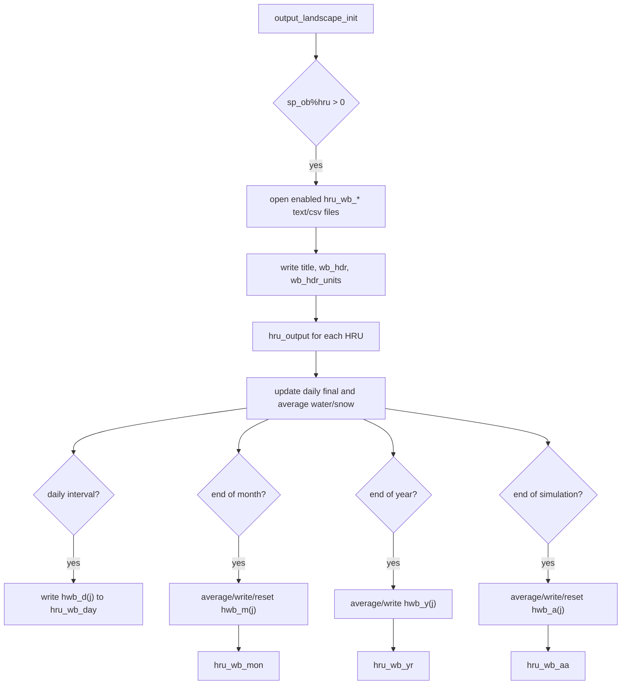

**SWAT+ version:** SWAT+ © 2026 `61.0.2.61`  
**Kind:** output family  
**Opened by:** `output_landscape_init`  
**Written by:** `hru_output`  
**Primary data type:** `output_landscape_module::output_waterbal`  
**Files covered:** `hru_wb_day`, `hru_wb_mon`, `hru_wb_yr`, `hru_wb_aa` text/CSV pairs

## Bottom Line

`hru_wb_*` is the HRU water-balance time-series output family. It uses one shared record layout for daily, monthly, yearly, and average-annual reporting. Each row represents one HRU for one reporting period, starts with time and HRU identity fields, expands an `output_waterbal` state object, and appends land-use management descriptors from `lum(ilu)`.

This should be one documentation page, not four nearly identical pages. The frequency-specific part is the file name, unit number, print condition, and source state object: `hwb_d(j)`, `hwb_m(j)`, `hwb_y(j)`, or `hwb_a(j)`.

## Output Family

| Frequency | Text File | CSV File | Text Unit | CSV Unit | State Written | Write Lines |
|---|---|---|---:|---:|---|---|
| Daily | `hru_wb_day.txt` | `hru_wb_day.csv` | 2000 | 2004 | `hwb_d(j)` | `hru_output.f90:62-67` |
| Monthly | `hru_wb_mon.txt` | `hru_wb_mon.csv` | 2001 | 2005 | `hwb_m(j)` | `hru_output.f90:121-125` |
| Yearly | `hru_wb_yr.txt` | `hru_wb_yr.csv` | 2002 | 2006 | `hwb_y(j)` | `hru_output.f90:192-196` |
| Average annual | `hru_wb_aa.txt` | `hru_wb_aa.csv` | 2003 | 2007 | `hwb_a(j)` | `hru_output.f90:244-248` |

## File Contracts

| Frequency | Open Condition | Open Lines | Header / Units | Catalog Entry |
|---|---|---|---|---|
| Daily | `sp_ob%hru > 0` and `pco%wb_hru%d == "y"` | `output_landscape_init.f90:16-31` | `wb_hdr`, `wb_hdr_units` | `HRU hru_wb_day.txt/csv` |
| Monthly | `sp_ob%hru > 0` and `pco%wb_hru%m == "y"` | `output_landscape_init.f90:34-48` | `wb_hdr`, `wb_hdr_units` | `HRU hru_wb_mon.txt/csv` |
| Yearly | `sp_ob%hru > 0` and `pco%wb_hru%y == "y"` | `output_landscape_init.f90:51-65` | `wb_hdr`, `wb_hdr_units` | `HRU hru_wb_yr.txt/csv` |
| Average annual | `sp_ob%hru > 0` and `pco%wb_hru%a == "y"` | `output_landscape_init.f90:68-82` | `wb_hdr`, `wb_hdr_units` | `HRU hru_wb_aa.txt/csv` |

## Writer And Print Controls

| Control | Source Line | Applies To | Meaning |
|---|---:|---|---|
| `sp_ob%hru > 0` | `output_landscape_init.f90:16` | All files | HRU water-balance files are opened only when HRU objects exist. |
| `pco%wb_hru%d == "y"` | `output_landscape_init.f90:18`, `hru_output.f90:61` | Daily | Enables daily HRU water-balance output. |
| `pco%wb_hru%m == "y"` | `output_landscape_init.f90:34`, `hru_output.f90:120` | Monthly | Enables monthly HRU water-balance output. |
| `pco%wb_hru%y == "y"` | `output_landscape_init.f90:51`, `hru_output.f90:191` | Yearly | Enables yearly HRU water-balance output. |
| `pco%wb_hru%a == "y"` | `output_landscape_init.f90:68`, `hru_output.f90:243` | Average annual | Enables average-annual HRU water-balance output. |
| `pco%csvout == "y"` | `output_landscape_init.f90:25`, `hru_output.f90:64` | CSV companions | Enables CSV output beside the fixed-width text files. |
| `pco%day_print == "y"` and `pco%int_day_cur == pco%int_day` | `hru_output.f90:60` | Daily | Restricts daily rows to the configured print interval. |
| `time%end_mo == 1` | `hru_output.f90:101` | Monthly | Builds and writes monthly rows at month end. |
| `time%end_yr == 1` | `hru_output.f90:170` | Yearly | Builds and writes yearly rows at year end. |
| `time%end_sim == 1` | `hru_output.f90:234` | Average annual | Builds and writes average annual rows at simulation end. |

## Shared Record Layout

| Row Part | Columns | Source | Meaning |
|---|---|---|---|
| Title row | Basin name and program string | `output_landscape_init.f90:20, 35, 52, 69` | Identifies the model run. |
| Header row | `wb_hdr` | `output_landscape_init.f90:21, 36, 53, 70`; `output_landscape_module.f90:289-342` | Column names for time, HRU identity, water-balance values, and land-use descriptors. |
| Units row | `wb_hdr_units` | `output_landscape_init.f90:22, 37, 54, 71`; `output_landscape_module.f90:344-395` | Units for the water-balance columns. |
| Data row | `time`, `j`, `ob(iob)`, water-balance state, `lum(ilu)` | `hru_output.f90:62, 121, 192, 244` | One HRU water-balance record for the active frequency. |

```text
title:    bsn%name, prog
header:   wb_hdr
units:    wb_hdr_units
data:     jday mon day yr unit gis_id name hwb_*(j)... plant_cov mgt_ops
```

## Columns Written

| Column | Unit | Source Field | Source-Backed Meaning |
|---|---|---|---|
| `jday` |  | `time%day` | Julian day / simulation day counter written by `hru_output`. |
| `mon` |  | `time%mo` | Current simulation month. |
| `day` |  | `time%day_mo` | Day of month. |
| `yr` |  | `time%yrc` | Current simulation year count. |
| `unit` |  | `j` | HRU index, copied from the `ihru` argument. |
| `gis_id` |  | `ob(iob)%gis_id` | GIS/object id for the HRU object. |
| `name` |  | `ob(iob)%name` | Object name for the HRU object. |
| `precip` | `mm` | `hwb_*(j)%precip` | Precipitation falling as rain and snow. |
| `snofall` | `mm` | `hwb_*(j)%snofall` | Precipitation falling as snow, sleet, or freezing rain. |
| `snomlt` | `mm` | `hwb_*(j)%snomlt` | Snow or melting ice. |
| `surq_gen` | `mm` | `hwb_*(j)%surq_gen` | Surface runoff generated from the landscape. |
| `latq` | `mm` | `hwb_*(j)%latq` | Lateral soil flow. |
| `wateryld` | `mm` | `hwb_*(j)%wateryld` | Water yield, including surface runoff, lateral soil flow, and tile flow. |
| `perc` | `mm` | `hwb_*(j)%perc` | Water percolating out of the soil profile into the vadose zone. |
| `et` | `mm` | `hwb_*(j)%et` | Actual evapotranspiration from the soil. |
| `ecanopy` | `mm` | `hwb_*(j)%ecanopy` | Canopy evaporation component; source comment says this is not reported. |
| `eplant` | `mm` | `hwb_*(j)%eplant` | Plant transpiration. |
| `esoil` | `mm` | `hwb_*(j)%esoil` | Soil evaporation. |
| `surq_cont` | `mm` | `hwb_*(j)%surq_cont` | Surface runoff leaving the landscape. |
| `cn` | `---` | `hwb_*(j)%cn` | Average curve number for the timestep. |
| `sw_init` | `mm` | `hwb_*(j)%sw_init` | Initial soil water content of the soil profile at start of period. |
| `sw_final` | `mm` | `hwb_*(j)%sw_final` | Final soil water content at end of period. |
| `sw_ave` | `mm` | `hwb_*(j)%sw` | Average soil water content for the period. |
| `sw_300` | `mm` | `hwb_*(j)%sw_300` | Final soil water content in the upper 300 mm. |
| `sno_init` | `mm` | `hwb_*(j)%sno_init` | Initial snow-pack water content. |
| `sno_final` | `mm` | `hwb_*(j)%sno_final` | Final snow-pack water content. |
| `snopack` | `mm` | `hwb_*(j)%snopack` | Water equivalent in the snow pack. |
| `pet` | `mm` | `hwb_*(j)%pet` | Potential evapotranspiration. |
| `qtile` | `mm` | `hwb_*(j)%qtile` | Subsurface tile flow leaving the landscape. |
| `irr` | `mm` | `hwb_*(j)%irr` | Irrigation water applied. |
| `surq_runon` | `mm` | `hwb_*(j)%surq_runon` | Surface runoff from upland landscape. |
| `latq_runon` | `mm` | `hwb_*(j)%latq_runon` | Lateral soil flow from upland landscape. |
| `overbank` | `mm` | `hwb_*(j)%overbank` | Overbank flooding from channels. |
| `surq_cha` | `mm` | `hwb_*(j)%surq_cha` | Surface runoff flowing into channels. |
| `surq_res` | `mm` | `hwb_*(j)%surq_res` | Surface runoff flowing into reservoirs. |
| `surq_ls` | `mm` | `hwb_*(j)%surq_ls` | Surface runoff flowing onto the landscape. |
| `latq_cha` | `mm` | `hwb_*(j)%latq_cha` | Lateral soil flow into channels. |
| `latq_res` | `mm` | `hwb_*(j)%latq_res` | Lateral soil flow into reservoirs. |
| `latq_ls` | `mm` | `hwb_*(j)%latq_ls` | Lateral soil flow into a landscape element. |
| `gwsoilq` | `mm` | `hwb_*(j)%gwsoil` | Groundwater transferred to the soil profile when the water table is in the soil profile. |
| `satex` | `mm` | `hwb_*(j)%satex` | Saturation excess flow from high water table. |
| `satex_chan` | `mm` | `hwb_*(j)%satex_chan` | Saturation excess flow reaching the main channel. |
| `sw_change` | `mm` | `hwb_*(j)%delsw` | Change in soil water volume. |
| `lagsurf` | `mm` | `hwb_*(j)%lagsurf` | Surface runoff in transit to channel. |
| `laglatq` | `mm` | `hwb_*(j)%laglatq` | Lateral flow in transit to channel. |
| `lagsatex` | `mm` | `hwb_*(j)%lagsatex` | Saturation excess flow in transit to channel. |
| `wet_evap` | `mm` | `hwb_*(j)%wet_evap` | Evaporation from wetland surface. |
| `wet_oflo` | `mm` | `hwb_*(j)%wet_out` | Wetland outflow or spill. |
| `wet_stor` | `mm` | `hwb_*(j)%wet_stor` | Wetland storage at end of period. |
| `plant_cov` |  | `lum(ilu)%plant_cov` | Land-use plant cover descriptor appended after the water-balance object. |
| `mgt_ops` |  | `lum(ilu)%mgt_ops` | Land-use management operations descriptor appended after the water-balance object. |

## Frequency-Specific Behavior

| Frequency | State Preparation | Write Condition | Reset / Carry-Forward |
|---|---|---|---|
| Daily | `hwb_d(j)%sw_final = soil(j)%sw`; `hwb_d(j)%sw` and `hwb_d(j)%snopack` are averaged before write. | `pco%day_print == "y" .and. pco%int_day_cur == pco%int_day`; then `pco%wb_hru%d == "y"`. | `hwb_d(j)%sw_init` and `hwb_d(j)%sno_init` are set to the final values for the next period. |
| Monthly | `hwb_m(j)` accumulates `hwb_d(j)` through the month, then is divided by the number of days. | `time%end_mo == 1`; then `pco%wb_hru%m == "y"`. | `hwb_m(j)` is reset to `hwbz`, with `sw_init` and `sno_init` carried forward. |
| Yearly | `hwb_y(j)` accumulates monthly state and is averaged by `time%day_end_yr`. | `time%end_yr == 1`; then `pco%wb_hru%y == "y"`. | Yearly state contributes to `hwb_a(j)` for average-annual output. |
| Average annual | `hwb_a(j)` is divided by `time%yrs_prt` and `time%days_prt`, then final water/snow states are applied. | `time%end_sim == 1`; then `pco%wb_hru%a == "y"`. | Stores annual calibration helpers such as `hru(j)%precip_aa` and `hru(j)%flow(1:5)`, then resets `hwb_a(j)`. |

## Data Sources And Calculations

| Output Value | Source / Calculation | Upstream Producers | Notes |
|---|---|---|---|
| `j` | `j = ihru` | `hru_output` caller supplies the HRU id. | Used as the HRU array index and written as `unit`. |
| `iob` | `sp_ob1%hru + j - 1` | `hydrograph_module` object indexing. | Maps the HRU index to the object table for `gis_id` and `name`. |
| `ilu` | `hru(j)%land_use_mgt` | `hru_module` HRU state. | Selects `lum(ilu)` land-use metadata. |
| Daily `sw_final` | `soil(j)%sw` | `soil_module`, set before output. | Captures ending soil water for the current daily record. |
| Daily `sw_ave` | `(hwb_d(j)%sw_init + hwb_d(j)%sw_final) / 2.` | `hru_output.f90:55` | Average soil water is computed immediately before daily print. |
| Daily `sno_final` | `hru(j)%sno_mm` | `hru_module` snow state. | Captures ending snow water equivalent. |
| Daily `snopack` | `(hwb_d(j)%sno_init + hwb_d(j)%sno_final) / 2.` | `hru_output.f90:57` | Average snow-pack water equivalent for the daily record. |
| Monthly averages | `hwb_m(j) = hwb_m(j) // const` | `hru_output.f90:111-112` | Uses days in the month. |
| Yearly averages | `hwb_y(j) = hwb_y(j) // const` | `hru_output.f90:177-178` | Uses `time%day_end_yr`. |
| Average annual values | `hwb_a(j) / time%yrs_prt` and `hwb_a(j) // time%days_prt` | `hru_output.f90:237-238` | Final family member is simulation-summary output, not a normal timestep output. |

## Writer Flow

1. `output_landscape_init` checks that HRU objects exist.
2. For each enabled `pco%wb_hru` frequency, it opens the text file and writes the title, header, and units rows.
3. If CSV output is enabled, it opens the matching CSV file and writes comma-separated header and units rows.
4. During each HRU output call, `hru_output` updates daily final and average water/snow state.
5. Daily output writes `hwb_d(j)` at the configured print interval.
6. Month-end logic aggregates and averages `hwb_m(j)`, writes monthly rows, then resets monthly state.
7. Year-end logic aggregates and averages `hwb_y(j)`, writes yearly rows, and feeds average-annual state.
8. Simulation-end logic averages `hwb_a(j)`, writes average-annual rows, stores calibration helpers, and resets annual state.



## Line-Based I/O Trace

| Source Line | Procedure | Operation | Unit | File / Header | Fields |
|---:|---|---|---|---|---|
| 19 | `output_landscape_init` | `open_output_file` | `2000` | `hru_wb_day.txt` | Text daily output file. |
| 21-22 | `output_landscape_init` | `write` | `2000` | daily header/units | `wb_hdr`, `wb_hdr_units`. |
| 26 | `output_landscape_init` | `open_output_file` | `2004` | `hru_wb_day.csv` | CSV daily output file. |
| 34 | `output_landscape_init` | `open_output_file` | `2001` | `hru_wb_mon.txt` | Text monthly output file. |
| 43 | `output_landscape_init` | `open_output_file` | `2005` | `hru_wb_mon.csv` | CSV monthly output file. |
| 51 | `output_landscape_init` | `open_output_file` | `2002` | `hru_wb_yr.txt` | Text yearly output file. |
| 58 | `output_landscape_init` | `open_output_file` | `2006` | `hru_wb_yr.csv` | CSV yearly output file. |
| 68 | `output_landscape_init` | `open_output_file` | `2003` | `hru_wb_aa.txt` | Text average-annual output file. |
| 75 | `output_landscape_init` | `open_output_file` | `2007` | `hru_wb_aa.csv` | CSV average-annual output file. |
| 62-67 | `hru_output` | `write` | `2000/2004` | daily data row | `time`, `j`, `ob(iob)`, `hwb_d(j)`, `lum(ilu)`. |
| 121-125 | `hru_output` | `write` | `2001/2005` | monthly data row | `time`, `j`, `ob(iob)`, `hwb_m(j)`, `lum(ilu)`. |
| 192-196 | `hru_output` | `write` | `2002/2006` | yearly data row | `time`, `j`, `ob(iob)`, `hwb_y(j)`, `lum(ilu)`. |
| 244-248 | `hru_output` | `write` | `2003/2007` | average-annual data row | `time`, `j`, `ob(iob)`, `hwb_a(j)`, `lum(ilu)`. |

## Review Notes

- `wb_hdr` includes `plant_cov` and `mgt_ops`, but `wb_hdr_units` appears to stop at `wet_stor`; the final two descriptor columns do not appear to have matching unit entries.
- The generated scanner currently sees many writer units as `unit_2000`, `unit_2004`, etc. A SWAT+-specific unit map from `open_output_file` calls should resolve these to literal output filenames.
- The row expands a derived type, so a final automated renderer needs to expand `hwb_d/m/y/a(j)` through `output_waterbal` and align it with `output_waterbal_header`.
- `ecanopy` has a source comment saying "not reported" even though the header and type include it; this deserves review before treating it as a user-facing active output.

## Source Links

- [`output_landscape_init.f90`](https://github.com/swat-model/swatplus/blob/cb442f7c05fc3bfc34349c446010f452d2737ca0/src/output_landscape_init.f90)
- [`hru_output.f90`](https://github.com/swat-model/swatplus/blob/cb442f7c05fc3bfc34349c446010f452d2737ca0/src/hru_output.f90)
- [`output_landscape_module.f90`](https://github.com/swat-model/swatplus/blob/cb442f7c05fc3bfc34349c446010f452d2737ca0/src/output_landscape_module.f90)

## Evidence Used

- `output_landscape_init.f90:16-82`
- `hru_output.f90:41-71`
- `hru_output.f90:101-163`
- `hru_output.f90:170-196`
- `hru_output.f90:234-261`
- `output_landscape_module.f90:5-48`
- `output_landscape_module.f90:289-395`
